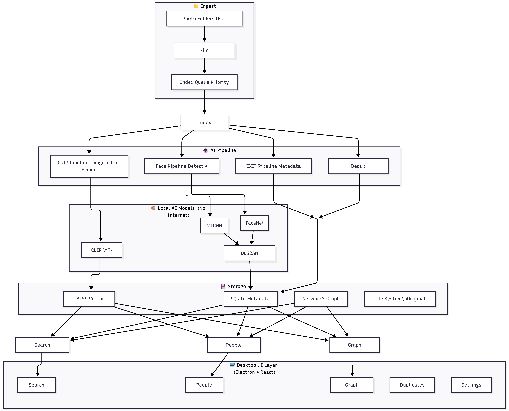

<p align="center">
  
</p>

<h1 align="center">PixelMind</h1>
<h3 align="center">Your Local-First AI Photo Intelligence System</h3>

<p align="center">
  
  
  
  
  
  
  
  
</p>

<p align="center">
  <b>PixelMind</b> is a fully offline, AI-powered desktop photo manager. It automatically understands, organizes, and connects your personal photo library — <i>without ever sending a single pixel to the cloud.</i>
</p>

---

## ✨ What Makes PixelMind Special?

> Your memories are private. They deserve to stay that way.

Most photo apps send your images to cloud servers to generate albums, recognize faces, and tag content. **PixelMind runs 100% on your own machine.** Every AI model — CLIP, MTCNN, FaceNet — runs locally. Your photos never leave your hard drive.

---

## 🚀 Features

| Feature | Description |
|---|---|
| 🔍 **Semantic Search** | Search your entire library in plain English — *"sunset at the beach"*, *"birthday cake"*, *"mountains in winter"* |
| 🧠 **AI Face Clustering** | Automatically groups photos by the people in them using MTCNN face detection + FaceNet embeddings |
| 🗂️ **Things Discovery** | Auto-discovers visual themes in your library (Cars, Nature, Portraits, Food) using CLIP + K-Means clustering |
| 📅 **Photo Timeline** | Browse your entire library chronologically |
| 🕸️ **Social Graph** | Visualizes who appears together most often using a NetworkX relationship graph |
| 📍 **EXIF & Geo** | Extracts dates, GPS, and camera model from photo metadata with offline reverse-geocoding |
| 🔁 **Duplicate Detection** | Finds near-identical images using perceptual hashing (pHash) with configurable Hamming-distance threshold |
| ⚡ **Real-time Indexing** | Progress-streamed image ingestion with Server-Sent Events (SSE) |
| 🖥️ **Desktop App** | Native Windows application built with Electron — no browser required |
| 🔒 **Privacy-First** | Zero cloud dependencies. No telemetry. No accounts. Your data stays yours. |

---

## 🏗️ Architecture

PixelMind uses a **sidecar architecture**: the Python AI backend runs as a local server alongside the React/Electron frontend.

```
┌──────────────────────────────────────────────────────────────┐
│                      Electron Shell                          │
│  ┌─────────────────────────────┐  ┌────────────────────────┐ │
│  │      React Frontend          │  │   Python AI Backend    │ │
│  │  (Vite + MUI + TanStack)     │◄─►  (FastAPI + Uvicorn)  │ │
│  └─────────────────────────────┘  └────────────┬───────────┘ │
└───────────────────────────────────────────────┼──────────────┘
                                                │
              ┌─────────────────────────────────┼──────────────┐
              │              AI Pipelines        │              │
              │  ┌──────────┐  ┌─────────────┐  │             │
              │  │   CLIP   │  │  FacePipeline│  │             │
              │  │ ViT-B/32 │  │ MTCNN+FaceNet│  │             │
              │  └────┬─────┘  └──────┬──────┘  │             │
              │       │               │          │             │
              │  ┌────┴───────────────┴──────────┴──────────┐ │
              │  │              Storage Layer                │ │
              │  │  FAISS Index │ SQLite DB │ NetworkX Graph│ │
              │  └───────────────────────────────────────────┘ │
              └────────────────────────────────────────────────┘
```

### High-Level Diagram

<p align="center">
  
</p>

---

## 🧩 Tech Stack

### Backend (AI Engine)

| Component | Technology | Purpose |
|---|---|---|
| **API Server** | FastAPI + Uvicorn | REST API + SSE streaming |
| **Semantic Encoding** | OpenCLIP `ViT-B/32` | 512-D image & text embeddings |
| **Face Detection** | MTCNN (facenet-pytorch) | Multi-scale face bounding box detection |
| **Face Recognition** | FaceNet `InceptionResnetV1` (VGGFace2) | 512-D face embeddings for identity matching |
| **Face Clustering** | Incremental Nearest-Centroid | Online clustering without re-clustering entire DB |
| **Semantic Clustering** | Scikit-learn K-Means | Groups visually similar images into "Things" |
| **Vector Store** | FAISS `IndexFlatL2` | Millisecond nearest-neighbour search |
| **Relational DB** | SQLite (WAL mode) | Images, metadata, faces, clusters, duplicates |
| **Graph Engine** | NetworkX | Person co-occurrence social graph |
| **Metadata Extraction** | Pillow + Piexif | EXIF date, GPS, camera model |
| **Geocoding** | reverse_geocoder (offline) | GPS → city/country without internet |
| **Duplicate Detection** | imagehash pHash | Perceptual hash with Hamming distance |
| **File Watcher** | watchdog | Auto-ingest on new files in watched folder |

### Frontend (Desktop UI)

| Component | Technology |
|---|---|
| **Desktop Shell** | Electron 41 |
| **UI Framework** | React 19 + Vite 8 |
| **Component Library** | MUI v6 (Material UI) |
| **Data Fetching** | TanStack React Query v5 |
| **Routing** | React Router v7 (HashRouter) |
| **Graph Visualization** | D3.js v7 |
| **HTTP Client** | Axios |

---

## 📂 Project Structure

```
PixelMind/
├── backend/
│   ├── api/
│   │   ├── main.py              # FastAPI app, CORS, route registration
│   │   ├── sse.py               # Server-Sent Events streaming
│   │   └── routes/
│   │       ├── search.py        # Semantic + metadata search endpoint
│   │       ├── images.py        # Image & thumbnail serving
│   │       ├── people.py        # Face clusters CRUD + image unlinking
│   │       ├── things.py        # K-Means semantic category discovery
│   │       ├── index_routes.py  # Ingest trigger + SSE progress
│   │       ├── graph_routes.py  # Social graph query
│   │       └── duplicate_routes.py  # Duplicate detection + deletion
│   ├── pipelines/
│   │   ├── ingest.py            # Master orchestrator (8-step pipeline)
│   │   ├── clip_pipeline.py     # CLIP encoding (image + text)
│   │   ├── face_pipeline.py     # MTCNN detect → FaceNet embed → cluster
│   │   ├── exif_pipeline.py     # EXIF metadata + reverse geocoding
│   │   ├── dedup_pipeline.py    # pHash deduplication
│   │   └── watcher.py           # Watchdog file system monitor
│   ├── search/
│   │   ├── search_engine.py     # 3-path merge search + re-ranking
│   │   ├── faiss_store.py       # FAISS index wrapper (CLIP + Face)
│   │   └── filters.py           # SQLite metadata filter builder
│   ├── graph/
│   │   └── graph_manager.py     # NetworkX graph build + query
│   ├── db/
│   │   ├── db.py                # SQLite connection manager
│   │   └── schema.sql           # Full DB schema (WAL, foreign keys)
│   └── utils/
│       ├── config.py            # Centralized paths & hyperparameters
│       └── thumbnail.py         # Thumbnail generation pipeline
├── frontend/
│   ├── electron/
│   │   ├── main.cjs             # Electron main process + backend launcher
│   │   └── preload.cjs          # Context bridge (IPC: folder picker)
│   ├── src/
│   │   ├── App.jsx              # Root router (HashRouter)
│   │   ├── api/client.js        # Centralized Axios API client
│   │   ├── pages/
│   │   │   ├── TimelinePage.jsx
│   │   │   ├── SearchPage.jsx
│   │   │   ├── PeoplePage.jsx
│   │   │   ├── PersonDetailPage.jsx
│   │   │   ├── ThingsPage.jsx
│   │   │   ├── ThingDetailPage.jsx
│   │   │   ├── GraphPage.jsx
│   │   │   ├── DuplicatesPage.jsx
│   │   │   └── SettingsPage.jsx
│   │   └── components/
│   │       ├── Sidebar.jsx      # Navigation drawer
│   │       └── TopBar.jsx       # Search bar + theme toggle
│   └── package.json             # NPM config + electron-builder config
├── packaging/
│   └── pixelmind_backend.spec   # PyInstaller spec for backend EXE
├── Resources/                   # Architecture diagrams & branding
└── backend/requirements.txt     # Python dependencies
```

---

## ⚙️ How It Works: The 8-Step Ingestion Pipeline

When you point PixelMind at a folder, every image goes through a sequential AI pipeline:

```
📁 Folder Scan
    │
    ▼
1️⃣  SHA-256 Hash → Skip already-indexed images (binary dedup)
    │
    ▼
2️⃣  DB Insert → Register image in SQLite
    │
    ▼
3️⃣  CLIP Encode → Generate 512-D semantic embedding → Store in FAISS
    │
    ▼
4️⃣  EXIF Extract → Parse date, GPS, camera → Offline geocode → Store
    │
    ▼
5️⃣  pHash → Compute perceptual hash for near-duplicate detection
    │
    ▼
6️⃣  Face Detect & Embed → MTCNN → crop → FaceNet → 512-D vector
    │
    ▼
7️⃣  Incremental Clustering → Assign face to nearest centroid cluster
    │
    ▼
8️⃣  Thumbnail Generate → 256×256 JPEG → Serve via /images/thumbnail/{id}
```

---

## 🔍 The Search Engine: 3-Path Merge

PixelMind's search is a **multi-path fusion engine** that combines three independent signals:

```
Query: "Shivam at sunset"

Path 1: CLIP Semantic  →  FAISS cosine search → [img_3, img_7, img_22, ...]
Path 2: Metadata Filter → SQLite date/location → [img_7, img_22, img_45, ...]  
Path 3: Person Search   → Graph/DB face lookup → [img_7, img_22, img_60, ...]

Merge (AND): {img_7, img_22}

Re-Rank: Sort by CLIP distance (closest semantic match first)

Result: [img_22, img_7]
```

---

## 🛠️ Local Development Setup

### Prerequisites

- Python 3.10+
- Node.js 18+
- Windows 10/11 (x64) — Linux/macOS support possible with minor tweaks

### 1. Clone the Repository

```bash
git clone https://github.com/Samrat-Madake/Pixel-Mind.git
cd Pixel-Mind
```

### 2. Set Up the Python Environment

```bash
# Create and activate virtual environment
python -m venv venv
.\venv\Scripts\activate   # Windows
# source venv/bin/activate  # Linux/macOS

# Install all dependencies
pip install -r backend/requirements.txt
pip install scikit-learn  # For Things clustering
```

### 3. Set Up the Frontend

```bash
cd frontend
npm install
```

### 4. Run in Development Mode

**Terminal 1 — Start the AI Backend:**
```bash
# From project root, with venv active
python -m backend.api.main
```

**Terminal 2 — Start the Desktop App:**
```bash
cd frontend
npm run electron:dev
```

The Electron window will open and connect automatically to the backend at `http://localhost:8000`.

---

## 📦 Building the Desktop Installer (Windows)

### Step 1: Compile the Python Backend

```bash
# From project root, with venv active
cd packaging
..\venv\Scripts\pyinstaller pixelmind_backend.spec --noconfirm
```

This creates `packaging/dist/pixelmind_backend/` — a self-contained EXE with all AI models bundled.

### Step 2: Build the Windows Installer

```bash
cd frontend
npm run build:win
```

> **Note:** Run this command in a terminal with **Administrator privileges** or with **Windows Developer Mode** enabled to allow symbolic link creation.

The final installer will be at:
```
frontend/release/PixelMind Setup 0.0.0.exe
```

---

## 📡 API Reference

The backend exposes a full REST API. Interactive docs are available at `http://localhost:8000/docs` when the server is running.

| Method | Endpoint | Description |
|---|---|---|
| `GET` | `/health` | System health: DB status + FAISS vector count |
| `GET` | `/search/?q={query}&k={n}` | Semantic + metadata search |
| `GET` | `/images/thumbnail/{id}` | Serve thumbnail JPEG |
| `POST` | `/index/` | Trigger folder ingestion |
| `GET` | `/index/status` | Get current indexing progress |
| `GET` | `/people/` | List all person clusters |
| `POST` | `/people/{id}/label` | Rename a person cluster |
| `DELETE`| `/people/{id}/images/{img_id}` | Unlink a misclassified image |
| `GET` | `/things/` | Auto-discover semantic clusters (K-Means) |
| `GET` | `/things/{cluster_id}` | Get all images in a cluster |
| `GET` | `/graph/{cluster_id}` | Get social graph for a person |
| `GET` | `/duplicates/` | List all near-duplicate pairs |
| `POST` | `/duplicates/delete` | Delete a duplicate image |

---

## 🗄️ Database Schema

```sql
images          -- Core image registry (id, file_path, sha256, phash, dimensions)
metadata        -- EXIF data (shot_date, GPS, camera, offline location)  
faces           -- Detected faces (bbox, cluster_id, confidence)
clusters        -- Person clusters (label, face_count, centroid)
embeddings_map  -- Maps FAISS index ID ↔ image_id
duplicates      -- Near-duplicate pairs (pHash Hamming distance)
```

All tables use `ON DELETE CASCADE` foreign keys. WAL journal mode is enabled for concurrent read performance.

---

## 🔧 Configuration

Core hyperparameters are in `backend/utils/config.py`:

```python
CLIP_MODEL_NAME   = "ViT-B-32"   # CLIP model variant
CLIP_DIM          = 512           # Embedding dimensions
DBSCAN_EPS        = 0.6           # Face clustering sensitivity (lower = stricter)
DBSCAN_MIN_SAMPLES= 2             # Min faces to form a cluster
PHASH_THRESHOLD   = 8             # Hamming distance for duplicate detection
THUMBNAIL_SIZE    = (256, 256)    # Thumbnail resolution
CLIP_BATCH_SIZE   = 4             # Reduce for low-RAM systems
CPU_ONLY          = True          # Force CPU inference (no GPU required)
```

---

## 🤝 Contributing

Contributions are welcome! Here's how to get started:

1. Fork the repository
2. Create a feature branch: `git checkout -b feat/your-amazing-feature`
3. Make your changes and test them
4. Commit: `git commit -m "feat: add your amazing feature"`
5. Push: `git push origin feat/your-amazing-feature`
6. Open a Pull Request

---

## 📋 Roadmap

- [ ] **v1.1** — GPU acceleration support (CUDA/ROCm)
- [ ] **v1.2** — Auto-generated Albums by date & location clusters
- [ ] **v1.3** — Video thumbnail + metadata support
- [ ] **v1.4** — macOS & Linux packaging
- [ ] **v2.0** — On-device LLM for natural language photo descriptions

---

## 📄 License

This project is licensed under the **MIT License** — see the [LICENSE](LICENSE) file for details.

---

<p align="center">
  Built with ❤️ by <a href="https://github.com/Samrat-Madake">Samrat Madake</a>
  <br/>
  <i>Because your memories deserve intelligence, not surveillance.</i>
</p>
